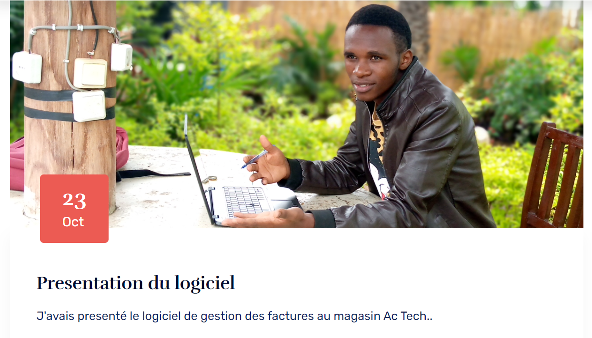
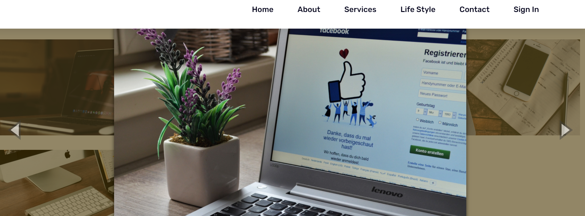
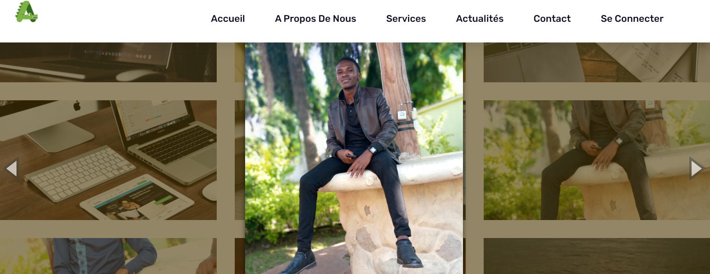

<h1>Ambaza Marcellin Web site</h1>

<h2>screenshoots</h2>
 
 
 
 
 

<h3>How To install:</h3>

    <ul>to connect:
        <li>Email:ambaza@gmail.com</li>
        <li>Password:Burundi</li>
    </ul>

<ol>
    <li>git clone </li>
    <li>env. configuration</li>
    <li>config(folder)/database configuration</li>
    <li>php artisan migrate</li>
    <li>php artisan db:seed</li>
    <li>php artisan serve</li>
</ol>
